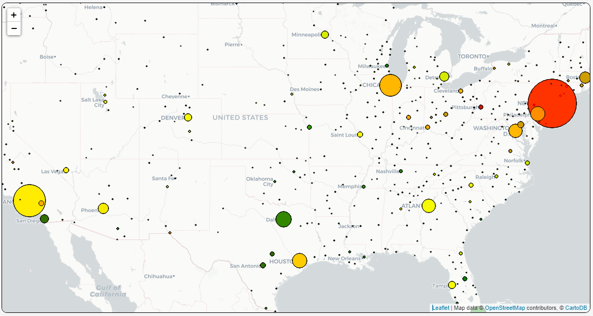
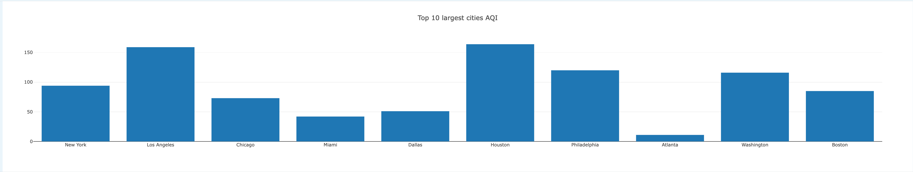
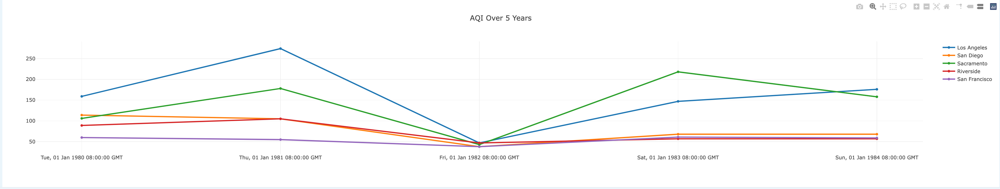

# Project 3: The Evoloution of Air Quality in the United States

## Overview
This project explores the relationship between population and air quality in the United States over several years. Users will be able to interact with the Flask API and view the corresponding air quality data for any specified date range.
## Collaborators
- `mattbreyes` Matthew Reyes
- `mattf4171` Matthew Fernandez
- `hasanhaider2468` Muhammad Haider 
- `nazelik` Nazeli Mnatsakanyan
- `jingsy119` Jing Sy
- `sanjana2000` Sanjana Islam
## Introduction
Using the `Flask API` in conjunction with `HTML`,`Javascript`, and `CSS`, we created an interactive interface where users can specify dates to display the results of the analysis. Through the use of `PGAdmin` and `SQL`, we created a database to house the data and used the Flask API to fetch and run the analysis while using Javascript to create the visualizations.

## Visualizations
- `Bubble Plot`
    - This graphic shows the population size in relation to the surrounding air quality of the city for a specific date.
    - 
- `Bar Plot`
    - This graphic shows the top 10 cities in terms of population size and their corresponding air quality rating.
    - 
- `Line Plot`
    - This graphic shows the 5 year evolution of air quality in certain cities.
    - 

To access the local Flask API, simply run the `app.py` file from the terminal.
# Citation
- [Air Quality csv](https://www.kaggle.com/datasets/calebreigada/us-air-quality-1980present)
